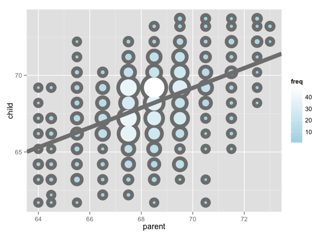
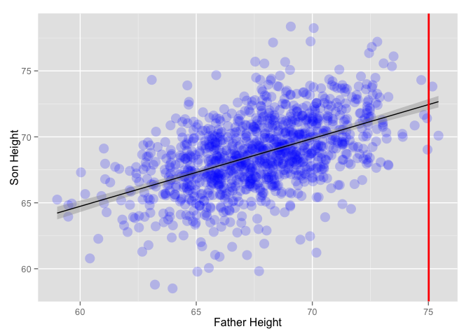

# RegressionModels
ppar  
8 Dec 2015  


```
## [1] "C/C/C/C/C/no_NO.UTF-8"
```

#Introduction to Regression - Code Snippet

##Plotting Marginal Distributions of the __Galton__data. 
The marginal distribution -> children not considering parents and parents not considering children.


```r
#install.packages("UsingR")
#install.packages("reshape")
library(UsingR)
data(galton)
library(reshape); 

long <- melt(galton)
g <- ggplot(long, aes(x = value, fill = variable)) 
g <- g + geom_histogram(colour = "black", binwidth=1) 
g <- g + facet_grid(. ~ variable)
g
```

 

##Finding the empirical mean via least square
Using the following interactive diagram to experiment how the MSE (Mean Squared Error) does change, changing the value of mu. Try to find out the the value of mu that minimize the MSE - What is this value? This value is the same as the sample mean of the data (empirical mean).


The following code snippet must be run in R/RStudio in order to use the manipulate functionality.


```r
library(manipulate)
myHist <- function(mu){
    mse <- mean((galton$child - mu)^2) #Showing the Mean Squared Error- sum of Squared Errors divided by n
    g <- ggplot(galton, aes(x = child)) + geom_histogram(fill = "salmon", colour = "black", binwidth=1)
    g <- g + geom_vline(xintercept = mu, size = 3)
    g <- g + ggtitle(paste("mu = ", mu, ", MSE = ", round(mse, 2), sep = ""))
    g
}
manipulate(myHist(mu), mu = slider(62, 74, step = 0.5))
```

Playing around the __mu=68__ is the value that minimizes MSE (MSE = 6.34). Teh actual empirical mean is 68.0884698. The least squared estimates is the empirical/ sample mean.


```r
mse <- mean((galton$child - mean(galton$child))^2)
mse
## [1] 6.333197
g <- ggplot(galton, aes(x = child)) + geom_histogram(fill = "salmon", colour = "black", binwidth=1)
g <- g + geom_vline(xintercept = mean(galton$child), size = 3)
g
```

 

##Comparing Children heights vs. Parent heights 

```r
ggplot(galton, aes(x = parent, y = child)) + geom_point()
```

 

One of the main weakness of such diagram is __OVERPLOTTING__. Let<U+00B4>s visualize the data using a different kind of scatterplot where frequence information is showed visually as the size/ color of the plot.


```r
library(dplyr)
freqData <- as.data.frame(table(galton$child, galton$parent))
names(freqData) <- c("child", "parent", "freq")
freqData$child <- as.numeric(as.character(freqData$child))
freqData$parent <- as.numeric(as.character(freqData$parent))
g <- ggplot(filter(freqData, freq > 0), aes(x = parent, y = child))
g <- g  + scale_size(range = c(2, 20), guide = "none" )
g <- g + geom_point(colour="grey50", aes(size = freq+10, show_guide = TRUE))
g <- g + geom_point(aes(colour=freq, size = freq))
g <- g + scale_colour_gradient(low = "lightblue", high="white")                    
g
```

 

##Regression through the origin 

```r
library(manipulate)
library(dplyr)
y <- galton$child - mean(galton$child)
x <- galton$parent - mean(galton$parent)
freqData <- as.data.frame(table(x, y))
names(freqData) <- c("child", "parent", "freq")
freqData$child <- as.numeric(as.character(freqData$child))
freqData$parent <- as.numeric(as.character(freqData$parent))
myPlot <- function(beta){
    g <- ggplot(filter(freqData, freq > 0), aes(x = parent, y = child))
    g <- g  + scale_size(range = c(2, 20), guide = "none" )
    g <- g + geom_point(colour="grey50", aes(size = freq+20, show_guide = FALSE))
    g <- g + geom_point(aes(colour=freq, size = freq))
    g <- g + scale_colour_gradient(low = "lightblue", high="white")                     
    g <- g + geom_abline(intercept = 0, slope = beta, size = 3)
    mse <- mean( (y - beta * x) ^2 )
    g <- g + ggtitle(paste("beta = ", beta, "mse = ", round(mse, 3)))
    g
}
manipulate(myPlot(beta), beta = slider(0.6, 1.2, step = 0.02))
```

Actually for beta = 0.64 the MSE gets its minimum value (circa 5).
 
 We can quickly calculate the slope for the regression through the origin using the following core function. The value found is the same as the previous (experiment).
 

```r
y <- galton$child
x <- galton$parent
fit <- lm(I(y - mean(y)) ~ I(x - mean(x)))
fit
## 
## Call:
## lm(formula = I(y - mean(y)) ~ I(x - mean(x)))
## 
## Coefficients:
##    (Intercept)  I(x - mean(x))  
##      6.309e-15       6.463e-01
summary(fit)
## 
## Call:
## lm(formula = I(y - mean(y)) ~ I(x - mean(x)))
## 
## Residuals:
##     Min      1Q  Median      3Q     Max 
## -7.8050 -1.3661  0.0487  1.6339  5.9264 
## 
## Coefficients:
##                 Estimate Std. Error t value Pr(>|t|)    
## (Intercept)    6.309e-15  7.348e-02    0.00        1    
## I(x - mean(x)) 6.463e-01  4.114e-02   15.71   <2e-16 ***
## ---
## Signif. codes:  0 '***' 0.001 '**' 0.01 '*' 0.05 '.' 0.1 ' ' 1
## 
## Residual standard error: 2.239 on 926 degrees of freedom
## Multiple R-squared:  0.2105,	Adjusted R-squared:  0.2096 
## F-statistic: 246.8 on 1 and 926 DF,  p-value: < 2.2e-16
```

Let's plot the best fitting line...


```r
freqData <- as.data.frame(table(galton$child, galton$parent))
names(freqData) <- c("child", "parent", "freq")
freqData$child <- as.numeric(as.character(freqData$child))
freqData$parent <- as.numeric(as.character(freqData$parent))
g <- ggplot(filter(freqData, freq > 0), aes(x = parent, y = child))
g <- g  + scale_size(range = c(2, 20), guide = "none" )
g <- g + geom_point(colour="grey50", aes(size = freq+20, show_guide = FALSE))
g <- g + geom_point(aes(colour=freq, size = freq))
g <- g + scale_colour_gradient(low = "lightblue", high="white")                    
lm1 <- lm(galton$child ~ galton$parent)
g <- g + geom_abline(intercept = coef(lm1)[1], slope = coef(lm1)[2], size = 3, colour = grey(.5))
g
```

 


#Statistical Regression Models Used for Prediction  

__Homework__ 
__1__ Fit a linear regression model to the father.son dataset: father as predictor & son as response
Give the P-value for the slope coefficient and perform the relevant hypothesis test.

__2__ Interpret both parameters. Recenter for the intercept if necessary.

__3__ Predict the son height if the father height is 80. Would you reccoment this prediction? Why or why not?


```r
## Part 1
library(UsingR)
library(ggplot2)
data(father.son)

g <- ggplot(father.son, aes(y = sheight, x = fheight))
g <- g + xlab("Father Height")
g <- g + ylab("Son Height")
g <- g + geom_point(size = 5, color = "blue", alpha = 0.2)
g <- g + geom_smooth(method = "lm", color = "black")
g
```

 

```r

#Calculate parameters of the linear regression model manually
x <- father.son$fheight
y <- father.son$sheight
beta1 <- cor(y,x) * (sd(y)/ sd(x))
beta0 <- mean(y) - beta1 * mean(x)
beta0
## [1] 33.8866
beta1
## [1] 0.514093

#Fit a linear regression model to the father.son dataset
#father as predictor & son as response
fit <- lm(y ~ x)
summary(fit)$coefficients
##              Estimate Std. Error  t value     Pr(>|t|)
## (Intercept) 33.886604 1.83235382 18.49348 1.604044e-66
## x            0.514093 0.02704874 19.00618 1.121268e-69

#Lets look at the beta1 coefficients
#Remember -> response = beta0 + beta1 * predictor
#                    Estimate Std. Error  t value     Pr(>|t|)
#(Intercept)        33.886604 1.83235382 18.49348 1.604044e-66
#father.son$fheight  0.514093 0.02704874 19.00618 1.121268e-69 (****)
#                                                    (**)
# The line (****) give information about the following hypothesis testing
# H0: beta1 = 0 and Ha: beta1 != 0
# (**) we have a t value of almost 20 and an p-valuo of 10^69.
# This imply that we are going to reject the null hypothesis (H0) and accept Ha
# so there is a linear relationship between the son and father heights


## Part 2
#Intercept: expected value of the response when the predictor is 0 (not very meaningful)
#slope: increase of the resposponse for a unit increase in the predictor

#Shifting can be applied to provide meaning to the Intercept
x <- father.son$fheight - mean(father.son$fheight)
y <- father.son$sheight

g <- ggplot(data.frame(x, y), aes(y = y, x = x))
g <- g + xlab("Father Height - mean")
g <- g + ylab("Son Height")
g <- g + geom_point(size = 5, color = "blue", alpha = 0.2)
g <- g + geom_smooth(method = "lm", color = "black")
g
```

 

```r

fit2 <- lm(y ~ x)
summary(fit2)$coefficients
##              Estimate Std. Error   t value     Pr(>|t|)
## (Intercept) 68.684070 0.07421078 925.52689 0.000000e+00
## x            0.514093 0.02704874  19.00618 1.121268e-69

#Intercept = 68.68 - the expected value of the response (son height) when 
#predictor is as the mean of father heights. Nope!! Slope unchanged

##Part 3
z <- 80
predict(fit, newdata = data.frame(x = z))
##        1 
## 75.01405
#Estimated heigh is circa 75
g <- ggplot(father.son, aes(y = sheight, x = fheight))
g <- g + xlab("Father Height")
g <- g + ylab("Son Height")
g <- g + geom_point(size = 5, color = "blue", alpha = 0.2)
g <- g + geom_smooth(method = "lm", color = "black")
g <- g + geom_vline(xintercept=75.01405, color = "red", size = 1)
g
```

 

```r
#Looking at the plot we can see a high variation and few data available for that specific estimate
#we would not trust much such estimate (look also at the summary of the father data and you will see
#that we are operating at the edge of the available data for our model..
```

__4__ Load the mtcarsdataset. Fit a linear regression model with miles per gallon as response and horsepower as predictor.
Interpret the coefficients and recenter intercept if necessary.


```r
data("mtcars")

g <- ggplot(mtcars, aes(y = mpg, x = hp))
g <- g + xlab("Horse Power")
g <- g + ylab("Miles Per Gallon")
g <- g + geom_point(size = 5, color = "blue", alpha = 0.2)
g <- g + geom_smooth(method = "lm", color = "black")
g
```

 

```r

fit <- lm(mpg ~ hp, data = mtcars)
summary(fit)$coefficients
##                Estimate Std. Error   t value     Pr(>|t|)
## (Intercept) 30.09886054  1.6339210 18.421246 6.642736e-18
## hp          -0.06822828  0.0101193 -6.742389 1.787835e-07

#               Estimate Std. Error   t value     Pr(>|t|)
#(Intercept) 30.09886054  1.6339210 18.421246 6.642736e-18
#hp          -0.06822828  0.0101193 -6.742389 1.787835e-07

#Intercept -> expected response value when predictor value is 0 (not meaningful)
#Shifting is necessary in order to give meaning to the intercept

fit <- lm(mpg ~ I(hp - mean(hp)), data = mtcars)
summary(fit)$coefficients
##                     Estimate Std. Error   t value     Pr(>|t|)
## (Intercept)      20.09062500  0.6828817 29.420360 1.101810e-23
## I(hp - mean(hp)) -0.06822828  0.0101193 -6.742389 1.787835e-07

#                    Estimate Std. Error   t value     Pr(>|t|)
#(Intercept)      20.09062500  0.6828817 29.420360 1.101810e-23
#I(hp - mean(hp)) -0.06822828  0.0101193 -6.742389 1.787835e-07

#Now Intercept is the expected response value when predictor has average value of horse power car
#Slope (not changed with the shifting): increase/decrease of the response for a unit increase in the predictor.

#Is there a linear model between x and y?
#slope          -0.06822828  0.0101193 -6.742389 1.787835e-07
#Ho: beta1 = slope = 0, Ha: beta1 = slope != 0
#t statistic is -6.7 and the P-Value is 10^-7 pretty slow so we can reject the null hypothesis
```
