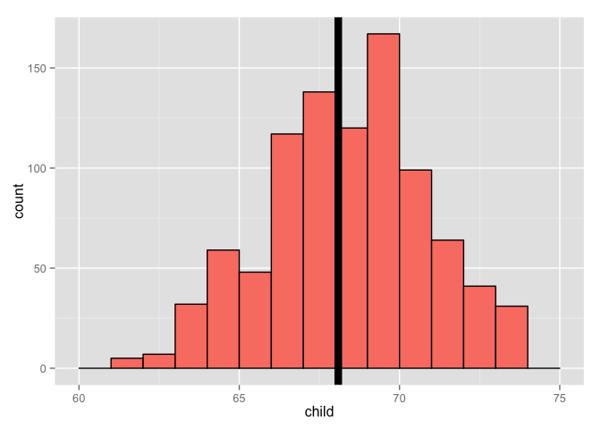

# RegressionModels
ppar  
8 Dec 2015  


```
## [1] "C/C/C/C/C/no_NO.UTF-8"
```

#Introduction to Regression - Code Snippet

##Plotting Marginal Distributions of the __Galton__data. 
The marginal distribution -> children not considering parents and parents not considering children.


```r
#install.packages("UsingR")
#install.packages("reshape")
library(UsingR)
data(galton)
library(reshape); 

long <- melt(galton)
g <- ggplot(long, aes(x = value, fill = variable)) 
g <- g + geom_histogram(colour = "black", binwidth=1) 
g <- g + facet_grid(. ~ variable)
g
```

 

##Finding the empirical mean via least square
Using the following interactive diagram to experiment how the MSE (Mean Squared Error) does change, changing the value of mu. Try to find out the the value of mu that minimize the MSE - What is this value? This value is the same as the sample mean of the data (empirical mean).


The following code snippet must be run in R/RStudio in order to use the manipulate functionality.


```r
library(manipulate)
myHist <- function(mu){
    mse <- mean((galton$child - mu)^2) #Showing the Mean Squared Error- sum of Squared Errors divided by n
    g <- ggplot(galton, aes(x = child)) + geom_histogram(fill = "salmon", colour = "black", binwidth=1)
    g <- g + geom_vline(xintercept = mu, size = 3)
    g <- g + ggtitle(paste("mu = ", mu, ", MSE = ", round(mse, 2), sep = ""))
    g
}
manipulate(myHist(mu), mu = slider(62, 74, step = 0.5))
```

Playing around the __mu=68__ is the value that minimizes MSE (MSE = 6.34). Teh actual empirical mean is 68.0884698. The least squared estimates is the empirical/ sample mean.


```r
mse <- mean((galton$child - mean(galton$child))^2)
mse
## [1] 6.333197
g <- ggplot(galton, aes(x = child)) + geom_histogram(fill = "salmon", colour = "black", binwidth=1)
g <- g + geom_vline(xintercept = mean(galton$child), size = 3)
g
```

 

##Comparing Children heights vs. Parent heights 

```r
ggplot(galton, aes(x = parent, y = child)) + geom_point()
```

 

One of the main weakness of such diagram is __OVERPLOTTING__. Let<U+00B4>s visualize the data using a different kind of scatterplot where frequence information is showed visually as the size/ color of the plot.


```r
library(dplyr)
freqData <- as.data.frame(table(galton$child, galton$parent))
names(freqData) <- c("child", "parent", "freq")
freqData$child <- as.numeric(as.character(freqData$child))
freqData$parent <- as.numeric(as.character(freqData$parent))
g <- ggplot(filter(freqData, freq > 0), aes(x = parent, y = child))
g <- g  + scale_size(range = c(2, 20), guide = "none" )
g <- g + geom_point(colour="grey50", aes(size = freq+10, show_guide = TRUE))
g <- g + geom_point(aes(colour=freq, size = freq))
g <- g + scale_colour_gradient(low = "lightblue", high="white")                    
g
```

 
