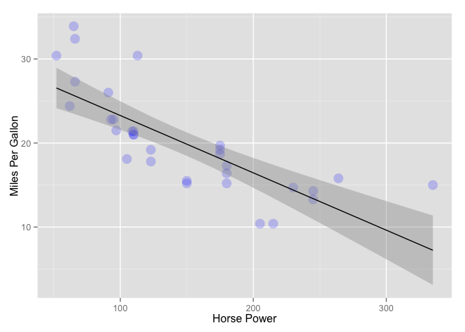
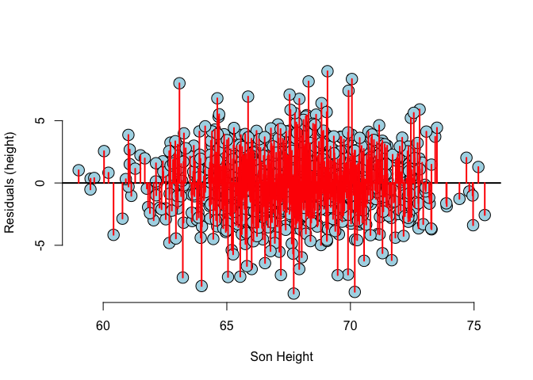
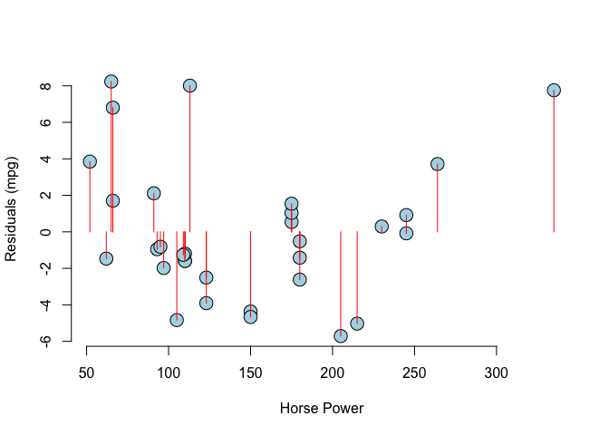

# RegressionModels
ppar  
8 Dec 2015  


```
## [1] "LC_CTYPE=C;LC_NUMERIC=C;LC_TIME=C;LC_COLLATE=C;LC_MONETARY=C;LC_MESSAGES=en_US.UTF-8;LC_PAPER=nb_NO.UTF-8;LC_NAME=C;LC_ADDRESS=C;LC_TELEPHONE=C;LC_MEASUREMENT=nb_NO.UTF-8;LC_IDENTIFICATION=C"
```

#Introduction to Regression - Code Snippet  

##Plotting Marginal Distributions of the __Galton__data. 
The marginal distribution -> children not considering parents and parents not considering children.


```r
#install.packages("UsingR")
#install.packages("reshape")
library(UsingR)
data(galton)
library(reshape); 

long <- melt(galton)
g <- ggplot(long, aes(x = value, fill = variable)) 
g <- g + geom_histogram(colour = "black", binwidth=1) 
g <- g + facet_grid(. ~ variable)
g
```

 

##Finding the empirical mean via least square
Using the following interactive diagram to experiment how the MSE (Mean Squared Error) does change, changing the value of mu. Try to find out the the value of mu that minimize the MSE - What is this value? This value is the same as the sample mean of the data (empirical mean).


The following code snippet must be run in R/RStudio in order to use the manipulate functionality.


```r
library(manipulate)
myHist <- function(mu){
    mse <- mean((galton$child - mu)^2) #Showing the Mean Squared Error- sum of Squared Errors divided by n
    g <- ggplot(galton, aes(x = child)) + geom_histogram(fill = "salmon", colour = "black", binwidth=1)
    g <- g + geom_vline(xintercept = mu, size = 3)
    g <- g + ggtitle(paste("mu = ", mu, ", MSE = ", round(mse, 2), sep = ""))
    g
}
manipulate(myHist(mu), mu = slider(62, 74, step = 0.5))
```

Playing around the __mu=68__ is the value that minimizes MSE (MSE = 6.34). Teh actual empirical mean is 68.0884698. The least squared estimates is the empirical/ sample mean.


```r
mse <- mean((galton$child - mean(galton$child))^2)
mse
## [1] 6.333197
g <- ggplot(galton, aes(x = child)) + geom_histogram(fill = "salmon", colour = "black", binwidth=1)
g <- g + geom_vline(xintercept = mean(galton$child), size = 3)
g
```

 

##Comparing Children heights vs. Parent heights 

```r
ggplot(galton, aes(x = parent, y = child)) + geom_point()
```

 

One of the main weakness of such diagram is __OVERPLOTTING__. Let<U+00B4>s visualize the data using a different kind of scatterplot where frequence information is showed visually as the size/ color of the plot.


```r
library(dplyr)
freqData <- as.data.frame(table(galton$child, galton$parent))
names(freqData) <- c("child", "parent", "freq")
freqData$child <- as.numeric(as.character(freqData$child))
freqData$parent <- as.numeric(as.character(freqData$parent))
g <- ggplot(filter(freqData, freq > 0), aes(x = parent, y = child))
g <- g  + scale_size(range = c(2, 20), guide = "none" )
g <- g + geom_point(colour="grey50", aes(size = freq+10, show_guide = TRUE))
g <- g + geom_point(aes(colour=freq, size = freq))
g <- g + scale_colour_gradient(low = "lightblue", high="white")                    
g
```

 

##Regression through the origin 

```r
library(manipulate)
library(dplyr)
y <- galton$child - mean(galton$child)
x <- galton$parent - mean(galton$parent)
freqData <- as.data.frame(table(x, y))
names(freqData) <- c("child", "parent", "freq")
freqData$child <- as.numeric(as.character(freqData$child))
freqData$parent <- as.numeric(as.character(freqData$parent))
myPlot <- function(beta){
    g <- ggplot(filter(freqData, freq > 0), aes(x = parent, y = child))
    g <- g  + scale_size(range = c(2, 20), guide = "none" )
    g <- g + geom_point(colour="grey50", aes(size = freq+20, show_guide = FALSE))
    g <- g + geom_point(aes(colour=freq, size = freq))
    g <- g + scale_colour_gradient(low = "lightblue", high="white")                     
    g <- g + geom_abline(intercept = 0, slope = beta, size = 3)
    mse <- mean( (y - beta * x) ^2 )
    g <- g + ggtitle(paste("beta = ", beta, "mse = ", round(mse, 3)))
    g
}
manipulate(myPlot(beta), beta = slider(0.6, 1.2, step = 0.02))
```

Actually for beta = 0.64 the MSE gets its minimum value (circa 5).
 
 We can quickly calculate the slope for the regression through the origin using the following core function. The value found is the same as the previous (experiment).
 

```r
y <- galton$child
x <- galton$parent
fit <- lm(I(y - mean(y)) ~ I(x - mean(x)))
fit
## 
## Call:
## lm(formula = I(y - mean(y)) ~ I(x - mean(x)))
## 
## Coefficients:
##    (Intercept)  I(x - mean(x))  
##      6.309e-15       6.463e-01
summary(fit)
## 
## Call:
## lm(formula = I(y - mean(y)) ~ I(x - mean(x)))
## 
## Residuals:
##     Min      1Q  Median      3Q     Max 
## -7.8050 -1.3661  0.0487  1.6339  5.9264 
## 
## Coefficients:
##                 Estimate Std. Error t value Pr(>|t|)    
## (Intercept)    6.309e-15  7.348e-02    0.00        1    
## I(x - mean(x)) 6.463e-01  4.114e-02   15.71   <2e-16 ***
## ---
## Signif. codes:  0 '***' 0.001 '**' 0.01 '*' 0.05 '.' 0.1 ' ' 1
## 
## Residual standard error: 2.239 on 926 degrees of freedom
## Multiple R-squared:  0.2105,	Adjusted R-squared:  0.2096 
## F-statistic: 246.8 on 1 and 926 DF,  p-value: < 2.2e-16
```

Let's plot the best fitting line...


```r
freqData <- as.data.frame(table(galton$child, galton$parent))
names(freqData) <- c("child", "parent", "freq")
freqData$child <- as.numeric(as.character(freqData$child))
freqData$parent <- as.numeric(as.character(freqData$parent))
g <- ggplot(filter(freqData, freq > 0), aes(x = parent, y = child))
g <- g  + scale_size(range = c(2, 20), guide = "none" )
g <- g + geom_point(colour="grey50", aes(size = freq+20, show_guide = FALSE))
g <- g + geom_point(aes(colour=freq, size = freq))
g <- g + scale_colour_gradient(low = "lightblue", high="white")                    
lm1 <- lm(galton$child ~ galton$parent)
g <- g + geom_abline(intercept = coef(lm1)[1], slope = coef(lm1)[2], size = 3, colour = grey(.5))
g
```

 


#Statistical Regression Models Used for Prediction  

__Homework__ 
__1__ Fit a linear regression model to the father.son dataset: father as predictor & son as response
Give the P-value for the slope coefficient and perform the relevant hypothesis test.

__2__ Interpret both parameters. Recenter for the intercept if necessary.

__3__ Predict the son height if the father height is 80. Would you reccoment this prediction? Why or why not?


```r
## Part 1
library(UsingR)
library(ggplot2)
data(father.son)

g <- ggplot(father.son, aes(y = sheight, x = fheight))
g <- g + xlab("Father Height")
g <- g + ylab("Son Height")
g <- g + geom_point(size = 5, color = "blue", alpha = 0.2)
g <- g + geom_smooth(method = "lm", color = "black")
g
```

 

```r

#Calculate parameters of the linear regression model manually
x <- father.son$fheight
y <- father.son$sheight
beta1 <- cor(y,x) * (sd(y)/ sd(x))
beta0 <- mean(y) - beta1 * mean(x)
beta0
## [1] 33.8866
beta1
## [1] 0.514093

#Fit a linear regression model to the father.son dataset
#father as predictor & son as response
fit <- lm(y ~ x)
summary(fit)$coefficients
##              Estimate Std. Error  t value     Pr(>|t|)
## (Intercept) 33.886604 1.83235382 18.49348 1.604044e-66
## x            0.514093 0.02704874 19.00618 1.121268e-69

#Lets look at the beta1 coefficients
#Remember -> response = beta0 + beta1 * predictor
#                    Estimate Std. Error  t value     Pr(>|t|)
#(Intercept)        33.886604 1.83235382 18.49348 1.604044e-66
#father.son$fheight  0.514093 0.02704874 19.00618 1.121268e-69 (****)
#                                                    (**)
# The line (****) give information about the following hypothesis testing
# H0: beta1 = 0 and Ha: beta1 != 0
# (**) we have a t value of almost 20 and an p-valuo of 10^69.
# This imply that we are going to reject the null hypothesis (H0) and accept Ha
# so there is a linear relationship between the son and father heights


## Part 2
#Intercept: expected value of the response when the predictor is 0 (not very meaningful)
#slope: increase of the resposponse for a unit increase in the predictor

#Shifting can be applied to provide meaning to the Intercept
x <- father.son$fheight - mean(father.son$fheight)
y <- father.son$sheight

g <- ggplot(data.frame(x, y), aes(y = y, x = x))
g <- g + xlab("Father Height - mean")
g <- g + ylab("Son Height")
g <- g + geom_point(size = 5, color = "blue", alpha = 0.2)
g <- g + geom_smooth(method = "lm", color = "black")
g
```

 

```r

fit2 <- lm(y ~ x)
summary(fit2)$coefficients
##              Estimate Std. Error   t value     Pr(>|t|)
## (Intercept) 68.684070 0.07421078 925.52689 0.000000e+00
## x            0.514093 0.02704874  19.00618 1.121268e-69

#Intercept = 68.68 - the expected value of the response (son height) when 
#predictor is as the mean of father heights. Nope!! Slope unchanged

##Part 3
z <- 80
predict(fit, newdata = data.frame(x = z))
##        1 
## 75.01405
#Estimated heigh is circa 75
g <- ggplot(father.son, aes(y = sheight, x = fheight))
g <- g + xlab("Father Height")
g <- g + ylab("Son Height")
g <- g + geom_point(size = 5, color = "blue", alpha = 0.2)
g <- g + geom_smooth(method = "lm", color = "black")
g <- g + geom_vline(xintercept=75.01405, color = "red", size = 1)
g
```

 

```r
#Looking at the plot we can see a high variation and few data available for that specific estimate
#we would not trust much such estimate (look also at the summary of the father data and you will see
#that we are operating at the edge of the available data for our model..
```

__4__ Load the mtcarsdataset. Fit a linear regression model with miles per gallon as response and horsepower as predictor.
Interpret the coefficients and recenter intercept if necessary.


```r
data("mtcars")

g <- ggplot(mtcars, aes(y = mpg, x = hp))
g <- g + xlab("Horse Power")
g <- g + ylab("Miles Per Gallon")
g <- g + geom_point(size = 5, color = "blue", alpha = 0.2)
g <- g + geom_smooth(method = "lm", color = "black")
g
```

 

```r

fit <- lm(mpg ~ hp, data = mtcars)
summary(fit)$coefficients
##                Estimate Std. Error   t value     Pr(>|t|)
## (Intercept) 30.09886054  1.6339210 18.421246 6.642736e-18
## hp          -0.06822828  0.0101193 -6.742389 1.787835e-07

#               Estimate Std. Error   t value     Pr(>|t|)
#(Intercept) 30.09886054  1.6339210 18.421246 6.642736e-18
#hp          -0.06822828  0.0101193 -6.742389 1.787835e-07

#Intercept -> expected response value when predictor value is 0 (not meaningful)
#Shifting is necessary in order to give meaning to the intercept

fit <- lm(mpg ~ I(hp - mean(hp)), data = mtcars)
summary(fit)$coefficients
##                     Estimate Std. Error   t value     Pr(>|t|)
## (Intercept)      20.09062500  0.6828817 29.420360 1.101810e-23
## I(hp - mean(hp)) -0.06822828  0.0101193 -6.742389 1.787835e-07

#                    Estimate Std. Error   t value     Pr(>|t|)
#(Intercept)      20.09062500  0.6828817 29.420360 1.101810e-23
#I(hp - mean(hp)) -0.06822828  0.0101193 -6.742389 1.787835e-07

#Now Intercept is the expected response value when predictor has average value of horse power car
#Slope (not changed with the shifting): increase/decrease of the response for a unit increase in the predictor.

#Is there a linear model between x and y?
#slope          -0.06822828  0.0101193 -6.742389 1.787835e-07
#Ho: beta1 = slope = 0, Ha: beta1 = slope != 0
#t statistic is -6.7 and the P-Value is 10^-7 pretty slow so we can reject the null hypothesis
```

#Residuals

__Homework__ 
__1__ Fit a linear regression model to the father.son dataset with the father as the predictor and the son as the outcome. Plot the son<U+2019>s height (horizontal axis) versus the residuals (vertical axis).

__2__ Directly estimate the residual variance and compare this estimate to the output of lm.

__3__ Give the R squared for this model.


```r
library(UsingR)
data("father.son")
#x: predictor, y: response
x <- father.son$fheight
y <- father.son$sheight
n <- length(x)

##Part 1
fit <- lm(y ~ x)
summary(fit)
## 
## Call:
## lm(formula = y ~ x)
## 
## Residuals:
##     Min      1Q  Median      3Q     Max 
## -8.8772 -1.5144 -0.0079  1.6285  8.9685 
## 
## Coefficients:
##             Estimate Std. Error t value Pr(>|t|)    
## (Intercept) 33.88660    1.83235   18.49   <2e-16 ***
## x            0.51409    0.02705   19.01   <2e-16 ***
## ---
## Signif. codes:  0 '***' 0.001 '**' 0.01 '*' 0.05 '.' 0.1 ' ' 1
## 
## Residual standard error: 2.437 on 1076 degrees of freedom
## Multiple R-squared:  0.2513,	Adjusted R-squared:  0.2506 
## F-statistic: 361.2 on 1 and 1076 DF,  p-value: < 2.2e-16
res <- resid(fit)

#Plor residuals vs predictor

plot(x, res,  
     xlab = "Son Height", 
     ylab = "Residuals (height)", 
     bg = "lightblue", 
     col = "black", cex = 2, pch = 21,frame = FALSE)
abline(h = 0, lwd = 2)
for (i in 1 : n) 
  lines(c(x[i], x[i]), c(res[i], 0), col = "red" , lwd = 2)
```

 

```r


##Note the possibility to use plot(fit)
#It will plot interactively different and relevant plots
#plot(fit)

##Part 2
#Residual variance
(1 / (n - 2)) * sum(res^2)
## [1] 5.936804
summary(fit)$sigma^2
## [1] 5.936804

##Part 3
ycappello <- predict(fit)
a_num <- sum((ycappello - mean(y))^2)
a_den <- sum((y - mean(y))^2)

rSquared <- a_num/ a_den
rSquared #25%
## [1] 0.2513401

summary(fit)$r.squared
## [1] 0.2513401
```

__4__ Load the mtcars dataset. Fit a linear regression with miles per gallon as the outcome and
horsepower as the predictor. Plot horsepower versus the residuals. 

__5__ Directly estimate the residual variance and compare this estimate to the output of lm.

__6__ Give the R squared for this model.


```r
##Part4
data("mtcars")
response <- mtcars$mpg
predictor1 <- mtcars$hp
n <- length(response)

fit <- lm(response ~ predictor1)
a_residuals <- resid(fit)

plot(predictor1, a_residuals,  
     xlab = "Horse Power", 
     ylab = "Residuals (mpg)", 
     bg = "lightblue", 
     col = "black", cex = 2, pch = 21,frame = FALSE)

for (i in 1 : n) 
  lines(c(predictor1[i], predictor1[i]), c(a_residuals[i], 0), col = "red" , lwd = 1)
```

 

```r


##Part 5
summary(fit)$sigma^2
## [1] 14.92248
(1/(n-2)) * sum(a_residuals^2)
## [1] 14.92248

##Part 6
responseCappello <- predict(fit)
a_num = sum((responseCappello - mean(response))^2)
a_den <- sum((response - mean(response))^2)
a_num / a_den #R squared
## [1] 0.6024373
summary(fit)$r.squared
## [1] 0.6024373
```

#Regression Inference  
__Part 1__  
1. Test whether the slope coefficient for the father.son data is different from zero (father as predictor, son as outcome).  
2. Refer to question 1. Form a confidence interval for the slope coefficient.  
3. Refer to question 1. Form a confidence interval for the intercept (center the fathers<U+2019> heights first to get an intercept that is easier to interpret).  
4. Refer to question 1. Form a mean value interval for the expected son<U+2019>s height at the average father<U+2019>s height.  
5. Refer to question 1. Form a prediction interval for the son<U+2019>s height at the average father<U+2019>s height.  


```r
rm(list = ls())
library(UsingR)
data("father.son")
x <- father.son$fheight; y <- father.son$sheight
fit <- lm(y ~ x)
summary(fit)$coefficients
##              Estimate Std. Error  t value     Pr(>|t|)
## (Intercept) 33.886604 1.83235382 18.49348 1.604044e-66
## x            0.514093 0.02704874 19.00618 1.121268e-69
```
1. 
             Estimate Std. Error  t value     Pr(>|t|)
(Intercept) 33.886604 1.83235382 18.49348 1.604044e-66
x            0.514093 0.02704874 19.00618 1.121268e-69

Slope -> Hypothesis Testing H0: slope = 0, Ha: slope != 0
t-statistic is pretty significant under the Null hypothesis and we can see that the probability of getting a result as extreme as the one  we got is around 10^-69 (zero)... so we can reject the null hypothesis under such conditions.
There is a linera relationship between the response and the predictor.

```r
#2. Confidence interval for the slope
e_beta1 <- summary(fit)$coefficients[2,1]
se_beta1 <- summary(fit)$coefficients[2,2]

e_beta1 + c(-1, 1) * qt(0.975, fit$df) * se_beta1
## [1] 0.4610188 0.5671673
#95% confidence interval  ....

#Another option is to use the confint function
confint(fit)
##                  2.5 %     97.5 %
## (Intercept) 30.2912126 37.4819961
## x            0.4610188  0.5671673
```


```r
#3. Confidence interval for the intercept
#The intercept is the expected value of the response when the predictor is 0 - not very meaningful in this condition
#Shifting the predictor

x_shifted <- father.son$fheight - mean(father.son$fheight)
fit2 <- lm(y ~ x_shifted)
summary(fit2)$coefficients
##              Estimate Std. Error   t value     Pr(>|t|)
## (Intercept) 68.684070 0.07421078 925.52689 0.000000e+00
## x_shifted    0.514093 0.02704874  19.00618 1.121268e-69
confint(fit2)
##                  2.5 %     97.5 %
## (Intercept) 68.5384554 68.8296839
## x_shifted    0.4610188  0.5671673

#Calculating it from scratch
beta0_e <- summary(fit2)$coefficients[1,1]
beta0_se <- summary(fit2)$coefficients[1,2]

beta0_e + c(-1,1) * qt(0.975, df=fit2$df) * beta0_se
## [1] 68.53846 68.82968
```


```r
#4. & 5. Mean Interval and Prediction interval
library(ggplot2)
x <- father.son$fheight; y <- father.son$sheight
newx <- data.frame(x = seq(min(x), max(x), length = 100))
p1 <- data.frame(predict(fit, newdata= newx,interval = ("confidence")))
p2 <- data.frame(predict(fit, newdata = newx,interval = ("prediction")))
p1$interval <- "confidence"
p2$interval <- "prediction"
p1$x <- newx$x
p2$x <- newx$x
dat <- rbind(p1, p2)
names(dat)[1] <- "y"

g <- ggplot(dat, aes(x = x, y = y))
g <- g + geom_ribbon(aes(ymin = lwr, ymax = upr, fill = interval), alpha = 0.2) 
g <- g + geom_line()
g <- g + geom_vline(xintercept = mean(x), color = "red")
g <- g + geom_point(data = data.frame(x = x, y=y), aes(x = x, y = y), size = 4)
g
```

 

```r

fatherHeigth_m <- data.frame(x = c(mean(x)))
predict(fit, newdata= fatherHeigth_m,interval = ("confidence"))
##        fit      lwr      upr
## 1 68.68407 68.53846 68.82968
predict(fit, newdata = fatherHeigth_m,interval = ("prediction"))
##        fit      lwr      upr
## 1 68.68407 63.90091 73.46723
```

#Multivariable Regression Analysis
##Simulation

```r
n <- 100
x1 <- rnorm(n)
x2 <- rnorm(n)
x3 <- rnorm(n)
#Generate the y
#adding an intercept and a gaussian noise
y <- 10 + x1 + x2 + x3 + rnorm(n, sd = .1)

#From y, x1, x2, x3 - let's estimate the coefficient model (linear regression model)
fit <- lm(y ~ x1 + x2 + x3)
summary(fit)
```

```
## 
## Call:
## lm(formula = y ~ x1 + x2 + x3)
## 
## Residuals:
##      Min       1Q   Median       3Q      Max 
## -0.21984 -0.05912  0.00671  0.05816  0.26297 
## 
## Coefficients:
##              Estimate Std. Error t value Pr(>|t|)    
## (Intercept) 10.004200   0.009852 1015.50   <2e-16 ***
## x1           1.011389   0.009493  106.55   <2e-16 ***
## x2           0.995654   0.010314   96.53   <2e-16 ***
## x3           0.983680   0.011533   85.29   <2e-16 ***
## ---
## Signif. codes:  0 '***' 0.001 '**' 0.01 '*' 0.05 '.' 0.1 ' ' 1
## 
## Residual standard error: 0.09679 on 96 degrees of freedom
## Multiple R-squared:  0.997,	Adjusted R-squared:  0.9969 
## F-statistic: 1.048e+04 on 3 and 96 DF,  p-value: < 2.2e-16
```

```r
#Coefficients:
#            Estimate Std. Error t value Pr(>|t|)    
#(Intercept) 10.01663    0.01089  920.02   <2e-16 ***
#x1           1.00083    0.01111   90.05   <2e-16 ***
#x2           0.99570    0.01221   81.55   <2e-16 ***
#x3           0.98936    0.01081   91.54   <2e-16 ***

#Let's try to calculate the coefficient using understandin behind
#how multivariable regression model works

#Estimate beta1 (x1)
#Get the residual where the response and predictor(x1) having moved out all of the
#others predictors (x2, x3) (same for y)

e_x1 <- resid(lm(x1 ~ x2 + x3))
e_y <- resid(lm(y ~ x2 + x3))

sum(e_x1 * e_y) / sum(e_x1^2)
```

```
## [1] 1.011389
```

```r
summary(lm(e_y ~ e_x1 - 1))$coefficients
```

```
##      Estimate Std. Error  t value      Pr(>|t|)
## e_x1 1.011389 0.00934768 108.1967 1.319826e-104
```
__Homework 1__  
1. Load datase Seatbelts and fit a linear mode of driver deaths (response) with kms and petrol as predictors. 

2. And predict the number of death at the average kms and petrol price.

3. Take the residuals fro DriversKilled having regressed out kms and an intercept and the residual fro petrol having regressed out kms and an intercept. Fit a regression through the origin of the two residuals and show that it is the same as the coefficient in step 1.


```r
library(datasets)
data("Seatbelts")

#Setabealts is a time series object so we need to transform into a dataframe
seatbelts <- as.data.frame(Seatbelts)
head(seatbelts)
```

```
##   DriversKilled drivers front rear   kms PetrolPrice VanKilled law
## 1           107    1687   867  269  9059   0.1029718        12   0
## 2            97    1508   825  265  7685   0.1023630         6   0
## 3           102    1507   806  319  9963   0.1020625        12   0
## 4            87    1385   814  407 10955   0.1008733         8   0
## 5           119    1632   991  454 11823   0.1010197        10   0
## 6           106    1511   945  427 12391   0.1005812        13   0
```

```r
fit <- lm(DriversKilled ~ kms + PetrolPrice, data = seatbelts)
summary(fit)$coefficients
```

```
##                  Estimate   Std. Error   t value     Pr(>|t|)
## (Intercept)  2.157461e+02 1.466559e+01 14.711047 3.772201e-33
## kms         -1.749546e-03 6.145401e-04 -2.846919 4.902428e-03
## PetrolPrice -6.437895e+02 1.482896e+02 -4.341435 2.304713e-05
```

```r
round(summary(fit)$coef,4)
```

```
##              Estimate Std. Error t value Pr(>|t|)
## (Intercept)  215.7461    14.6656 14.7110   0.0000
## kms           -0.0017     0.0006 -2.8469   0.0049
## PetrolPrice -643.7895   148.2896 -4.3414   0.0000
```

```r
#Looking at the coefficients (estimated) we can see that they have different magnitudes
#this make quite difficult to interpret the resul. Moreover if we look at the meaning of
#the intercept expected no of drivers killed when predictors are set to 0 
# (0 kms, 0 Petrol Price) (intercept is not very meaningful)

#What we can do is to center the kms and petrol price and maybe rescaling them to a more meaningful. For example looking at the data kms and Petrol Price

summary(seatbelts$kms)
```

```
##    Min. 1st Qu.  Median    Mean 3rd Qu.    Max. 
##    7685   12680   14990   14990   17200   21630
```

```r
#kms in the magnitude of thousand so 1km change is not actually really meaningful

summary(seatbelts$PetrolPrice)
```

```
##    Min. 1st Qu.  Median    Mean 3rd Qu.    Max. 
## 0.08118 0.09258 0.10450 0.10360 0.11410 0.13300
```

```r
#Petrol Price is in the magnitude 10^-1

#Lets do some change to our data structure and create more meaningful data for the regression
library(dplyr)
seatbelts <- mutate(seatbelts,
                   pp = (PetrolPrice - mean(PetrolPrice)) / sd(PetrolPrice),
                   mm = kms / 1000,
                   mmc = mm - mean(mm))
head(seatbelts)
```

```
##   DriversKilled drivers front rear   kms PetrolPrice VanKilled law
## 1           107    1687   867  269  9059   0.1029718        12   0
## 2            97    1508   825  265  7685   0.1023630         6   0
## 3           102    1507   806  319  9963   0.1020625        12   0
## 4            87    1385   814  407 10955   0.1008733         8   0
## 5           119    1632   991  454 11823   0.1010197        10   0
## 6           106    1511   945  427 12391   0.1005812        13   0
##            pp     mm       mmc
## 1 -0.05356454  9.059 -5.934604
## 2 -0.10356653  7.685 -7.308604
## 3 -0.12824699  9.963 -5.030604
## 4 -0.22591505 10.955 -4.038604
## 5 -0.21389350 11.823 -3.170604
## 6 -0.24990592 12.391 -2.602604
```

```r
fit <- lm(DriversKilled ~ mmc + pp, data = seatbelts)
summary(fit)
```

```
## 
## Call:
## lm(formula = DriversKilled ~ mmc + pp, data = seatbelts)
## 
## Residuals:
##    Min     1Q Median     3Q    Max 
## -51.06 -17.77  -4.15  15.67  59.33 
## 
## Coefficients:
##             Estimate Std. Error t value Pr(>|t|)    
## (Intercept) 122.8021     1.6629  73.850  < 2e-16 ***
## mmc          -1.7495     0.6145  -2.847   0.0049 ** 
## pp           -7.8387     1.8055  -4.341  2.3e-05 ***
## ---
## Signif. codes:  0 '***' 0.001 '**' 0.01 '*' 0.05 '.' 0.1 ' ' 1
## 
## Residual standard error: 23.04 on 189 degrees of freedom
## Multiple R-squared:  0.1844,	Adjusted R-squared:  0.1758 
## F-statistic: 21.37 on 2 and 189 DF,  p-value: 4.292e-09
```

```r
#Now the data seems more reasonable and meaningful (holding other predictors constant)
# mmc 1.7 decrease in death for a 1 increment (1000km) from the mean
# pp 7.83 decrease in death for a 1 standard deviation change in pp  

#Predict number of death for the average kms and PetrolPrice
seatbelts <- as.data.frame(Seatbelts)
y <- seatbelts$DriversKilled
x1 <- seatbelts$kms
x2 <- seatbelts$PetrolPrice

fit <- lm(y ~ x1 + x2)
predict(fit, newdata = data.frame(x1 = mean(x1), x2 = mean(x2)))
```

```
##        1 
## 122.8021
```

```r
#.3
seatbelts <- as.data.frame(Seatbelts)
dk <- seatbelts$DriversKilled
kms <- seatbelts$kms
pp <- seatbelts$PetrolPrice

fitfull <- lm(dk ~ kms + pp)

#Regreess kms out of dk including the intercept
edk <- resid(lm(dk ~ kms))
#Regreess kms out of pp including the intercept
epp <- resid(lm(pp ~ kms))
summary(lm(edk ~ epp - 1)) #no intercept, through the origin
```

```
## 
## Call:
## lm(formula = edk ~ epp - 1)
## 
## Residuals:
##    Min     1Q Median     3Q    Max 
## -51.06 -17.77  -4.15  15.67  59.33 
## 
## Coefficients:
##     Estimate Std. Error t value Pr(>|t|)    
## epp   -643.8      147.5  -4.364 2.09e-05 ***
## ---
## Signif. codes:  0 '***' 0.001 '**' 0.01 '*' 0.05 '.' 0.1 ' ' 1
## 
## Residual standard error: 22.92 on 191 degrees of freedom
## Multiple R-squared:  0.09068,	Adjusted R-squared:  0.08592 
## F-statistic: 19.05 on 1 and 191 DF,  p-value: 2.086e-05
```

```r
summary(fitfull)$coef
```

```
##                  Estimate   Std. Error   t value     Pr(>|t|)
## (Intercept)  2.157461e+02 1.466559e+01 14.711047 3.772201e-33
## kms         -1.749546e-03 6.145401e-04 -2.846919 4.902428e-03
## pp          -6.437895e+02 1.482896e+02 -4.341435 2.304713e-05
```

```r
#estimate for the pp is identical usingteh two different way to calculate it
```
#Multivariate Examples & Tricks


```r
require(datasets)
require(GGally)
## Loading required package: GGally
## 
## Attaching package: 'GGally'
## 
## The following object is masked from 'package:dplyr':
## 
##     nasa
require(ggplot2)

data("swiss")
#?swiss
g <- ggpairs(swiss, lower = list(continuous = "smooth"), params = c(method = "loess"))
g
```

 

```r

#lets see the result of calling lm on this datase
summary(lm(Fertility ~ ., data = swiss))
## 
## Call:
## lm(formula = Fertility ~ ., data = swiss)
## 
## Residuals:
##      Min       1Q   Median       3Q      Max 
## -15.2743  -5.2617   0.5032   4.1198  15.3213 
## 
## Coefficients:
##                  Estimate Std. Error t value Pr(>|t|)    
## (Intercept)      66.91518   10.70604   6.250 1.91e-07 ***
## Agriculture      -0.17211    0.07030  -2.448  0.01873 *  
## Examination      -0.25801    0.25388  -1.016  0.31546    
## Education        -0.87094    0.18303  -4.758 2.43e-05 ***
## Catholic          0.10412    0.03526   2.953  0.00519 ** 
## Infant.Mortality  1.07705    0.38172   2.822  0.00734 ** 
## ---
## Signif. codes:  0 '***' 0.001 '**' 0.01 '*' 0.05 '.' 0.1 ' ' 1
## 
## Residual standard error: 7.165 on 41 degrees of freedom
## Multiple R-squared:  0.7067,	Adjusted R-squared:  0.671 
## F-statistic: 19.76 on 5 and 41 DF,  p-value: 5.594e-10
summary(lm(Fertility ~ ., data = swiss))$coef
##                    Estimate  Std. Error   t value     Pr(>|t|)
## (Intercept)      66.9151817 10.70603759  6.250229 1.906051e-07
## Agriculture      -0.1721140  0.07030392 -2.448142 1.872715e-02
## Examination      -0.2580082  0.25387820 -1.016268 3.154617e-01
## Education        -0.8709401  0.18302860 -4.758492 2.430605e-05
## Catholic          0.1041153  0.03525785  2.952969 5.190079e-03
## Infant.Mortality  1.0770481  0.38171965  2.821568 7.335715e-03

#Unudjusted estimates
summary(lm(Fertility ~ Agriculture, data = swiss))
## 
## Call:
## lm(formula = Fertility ~ Agriculture, data = swiss)
## 
## Residuals:
##      Min       1Q   Median       3Q      Max 
## -25.5374  -7.8685  -0.6362   9.0464  24.4858 
## 
## Coefficients:
##             Estimate Std. Error t value Pr(>|t|)    
## (Intercept) 60.30438    4.25126  14.185   <2e-16 ***
## Agriculture  0.19420    0.07671   2.532   0.0149 *  
## ---
## Signif. codes:  0 '***' 0.001 '**' 0.01 '*' 0.05 '.' 0.1 ' ' 1
## 
## Residual standard error: 11.82 on 45 degrees of freedom
## Multiple R-squared:  0.1247,	Adjusted R-squared:  0.1052 
## F-statistic: 6.409 on 1 and 45 DF,  p-value: 0.01492

summary(lm(Fertility ~ Agriculture + Education + Examination, data = swiss))
## 
## Call:
## lm(formula = Fertility ~ Agriculture + Education + Examination, 
##     data = swiss)
## 
## Residuals:
##     Min      1Q  Median      3Q     Max 
## -14.967  -4.978  -1.045   4.906  21.358 
## 
## Coefficients:
##             Estimate Std. Error t value Pr(>|t|)    
## (Intercept) 99.80162    7.15523  13.948  < 2e-16 ***
## Agriculture -0.18017    0.08071  -2.232  0.03084 *  
## Education   -0.67242    0.19366  -3.472  0.00119 ** 
## Examination -0.79744    0.24679  -3.231  0.00237 ** 
## ---
## Signif. codes:  0 '***' 0.001 '**' 0.01 '*' 0.05 '.' 0.1 ' ' 1
## 
## Residual standard error: 8.601 on 43 degrees of freedom
## Multiple R-squared:  0.5568,	Adjusted R-squared:  0.5259 
## F-statistic: 18.01 on 3 and 43 DF,  p-value: 1.017e-07
```

__Homework 1__  
1. Load datase Seatbelts and fit a linear mode of driver deaths (response) with kms and petrol as predictors.

2. Repeat question 1 for the outcome being the log of the count of driver deaths. Interpret your coefficients.

3. Add the dummy variable law and interpret the results. Repeat this question
with a factor variable that you create called lawFactor that takes the levels No and Yes. Change the reference level from No to Yes.

4. Discretize the PetrolPrice variable into four factor levels. Fit the linear model with this factor to see how R treats multiple level factor variables


```r
library(datasets)
data("Seatbelts")

#Setabealts is a time series object so we need to transform into a dataframe
seatbelts <- as.data.frame(Seatbelts)
head(seatbelts)
##   DriversKilled drivers front rear   kms PetrolPrice VanKilled law
## 1           107    1687   867  269  9059   0.1029718        12   0
## 2            97    1508   825  265  7685   0.1023630         6   0
## 3           102    1507   806  319  9963   0.1020625        12   0
## 4            87    1385   814  407 10955   0.1008733         8   0
## 5           119    1632   991  454 11823   0.1010197        10   0
## 6           106    1511   945  427 12391   0.1005812        13   0

fit <- lm(DriversKilled ~ kms + PetrolPrice, data = seatbelts)
summary(fit)$coefficients
##                  Estimate   Std. Error   t value     Pr(>|t|)
## (Intercept)  2.157461e+02 1.466559e+01 14.711047 3.772201e-33
## kms         -1.749546e-03 6.145401e-04 -2.846919 4.902428e-03
## PetrolPrice -6.437895e+02 1.482896e+02 -4.341435 2.304713e-05
round(summary(fit)$coef,4)
##              Estimate Std. Error t value Pr(>|t|)
## (Intercept)  215.7461    14.6656 14.7110   0.0000
## kms           -0.0017     0.0006 -2.8469   0.0049
## PetrolPrice -643.7895   148.2896 -4.3414   0.0000
```


```r
library(datasets)
data("Seatbelts")
seatbelts <- as.data.frame(Seatbelts)
#2.
#logging of the outcome
library(dplyr)
#normalized in order to have a better scale
seatbelts <- mutate(seatbelts,
                   pp = (PetrolPrice - mean(PetrolPrice)) / sd(PetrolPrice),
                   mm = kms / 1000,
                   mmc = mm - mean(mm))
head(seatbelts)
##   DriversKilled drivers front rear   kms PetrolPrice VanKilled law
## 1           107    1687   867  269  9059   0.1029718        12   0
## 2            97    1508   825  265  7685   0.1023630         6   0
## 3           102    1507   806  319  9963   0.1020625        12   0
## 4            87    1385   814  407 10955   0.1008733         8   0
## 5           119    1632   991  454 11823   0.1010197        10   0
## 6           106    1511   945  427 12391   0.1005812        13   0
##            pp     mm       mmc
## 1 -0.05356454  9.059 -5.934604
## 2 -0.10356653  7.685 -7.308604
## 3 -0.12824699  9.963 -5.030604
## 4 -0.22591505 10.955 -4.038604
## 5 -0.21389350 11.823 -3.170604
## 6 -0.24990592 12.391 -2.602604

fit <- lm(I(log(DriversKilled)) ~ mmc + pp, data = seatbelts)
summary(fit)$coefficients
##                Estimate  Std. Error    t value      Pr(>|t|)
## (Intercept)  4.78966306 0.013426810 356.723817 2.737888e-269
## mmc         -0.01400794 0.004962149  -2.822959  5.267843e-03
## pp          -0.06412578 0.014579039  -4.398492  1.818005e-05

#All of the estimates are now interpreted in the log scale. We can then
exp( -0.06412578)
## [1] 0.937887
1 - exp( -0.06412578)
## [1] 0.06211298
#circa 6% decrease in geometric mean death for a 1 sd increase in pp holding mmc constant. 
#3.
fit <- lm(DriversKilled ~ mmc + pp + law, data = seatbelts)
summary(fit)
## 
## Call:
## lm(formula = DriversKilled ~ mmc + pp + law, data = seatbelts)
## 
## Residuals:
##    Min     1Q Median     3Q    Max 
## -50.69 -17.29  -4.05  14.33  60.71 
## 
## Coefficients:
##             Estimate Std. Error t value Pr(>|t|)    
## (Intercept) 124.2263     1.8012  68.967  < 2e-16 ***
## mmc          -1.2233     0.6657  -1.838 0.067676 .  
## pp           -6.9199     1.8514  -3.738 0.000246 ***
## law         -11.8892     6.0258  -1.973 0.049955 *  
## ---
## Signif. codes:  0 '***' 0.001 '**' 0.01 '*' 0.05 '.' 0.1 ' ' 1
## 
## Residual standard error: 22.87 on 188 degrees of freedom
## Multiple R-squared:  0.201,	Adjusted R-squared:  0.1882 
## F-statistic: 15.76 on 3 and 188 DF,  p-value: 3.478e-09
#The law variable is an factor variable and this doesc change our intercept.
#124 (intercept) is the expected number of death for the average ppn, the average km and before the law was in effect (law zero).
#If we want to know the intercept when the law was in effect we need to add -11.889 to the previous value. 11.889 fewer death were because of the law being in effect.
#Other variable are interpreted as before (with law variable constant (zero or one)
```


```r
#4.
library(datasets)
data("Seatbelts")
seatbelts <- as.data.frame(Seatbelts)
seatbelts <- mutate(seatbelts,
                   pp = (PetrolPrice - mean(PetrolPrice)) / sd(PetrolPrice),
                   ppf = as.factor((pp <=-1.5)+(pp<=0)+(pp<=1.5)+(pp<Inf)),
                   mm = kms / 1000,
                   mmc = mm - mean(mm))
head(seatbelts)
##   DriversKilled drivers front rear   kms PetrolPrice VanKilled law
## 1           107    1687   867  269  9059   0.1029718        12   0
## 2            97    1508   825  265  7685   0.1023630         6   0
## 3           102    1507   806  319  9963   0.1020625        12   0
## 4            87    1385   814  407 10955   0.1008733         8   0
## 5           119    1632   991  454 11823   0.1010197        10   0
## 6           106    1511   945  427 12391   0.1005812        13   0
##            pp ppf     mm       mmc
## 1 -0.05356454   3  9.059 -5.934604
## 2 -0.10356653   3  7.685 -7.308604
## 3 -0.12824699   3  9.963 -5.030604
## 4 -0.22591505   3 10.955 -4.038604
## 5 -0.21389350   3 11.823 -3.170604
## 6 -0.24990592   3 12.391 -2.602604
table(seatbelts$ppf)
## 
##  1  2  3  4 
##  6 96 71 19

fit <- lm(DriversKilled ~ mmc + ppf + law, data = seatbelts)
summary(fit)
## 
## Call:
## lm(formula = DriversKilled ~ mmc + ppf + law, data = seatbelts)
## 
## Residuals:
##     Min      1Q  Median      3Q     Max 
## -53.384 -17.211  -3.421  14.849  65.613 
## 
## Coefficients:
##             Estimate Std. Error t value Pr(>|t|)    
## (Intercept) 109.8405     9.5066  11.554   <2e-16 ***
## mmc          -1.2991     0.7668  -1.694   0.0919 .  
## ppf2         10.8271     9.9462   1.089   0.2778    
## ppf3         18.6904     9.9374   1.881   0.0616 .  
## ppf4         25.0074    10.9163   2.291   0.0231 *  
## law         -15.3445     6.0345  -2.543   0.0118 *  
## ---
## Signif. codes:  0 '***' 0.001 '**' 0.01 '*' 0.05 '.' 0.1 ' ' 1
## 
## Residual standard error: 23.24 on 186 degrees of freedom
## Multiple R-squared:  0.1833,	Adjusted R-squared:  0.1614 
## F-statistic:  8.35 on 5 and 186 DF,  p-value: 3.835e-07

#ppf1 is used (choosen) as a reference value - while the other are used explicitly in the model. Each coefficient estimate (ppf2, ppf3, ppf4) is interpreted as a comparison to the reference level.
```


